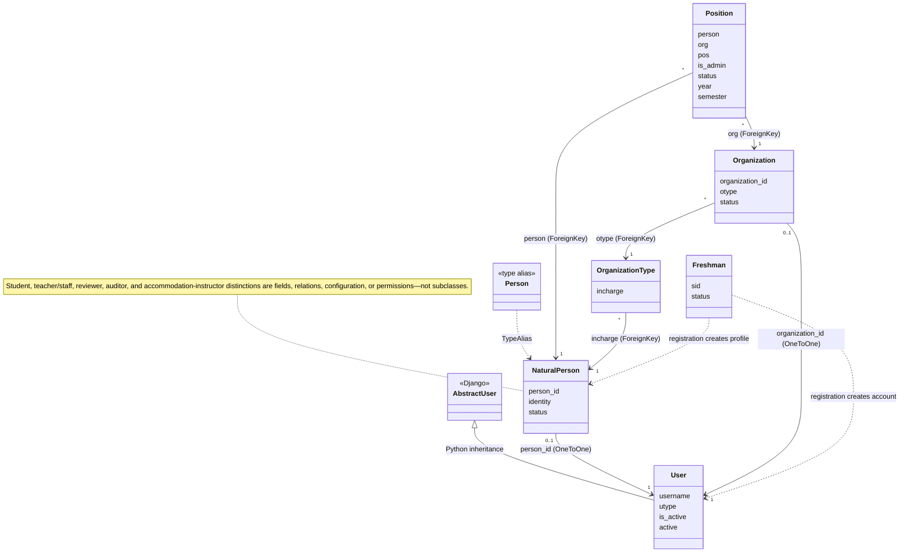

## Project Overview

This project is YuanPeiProFile(YPPF), a student and room management platform.
This project contains two parts, the website version front-end and back-end
and the backend API for Wechat Miniprogram. The website is implemented using
Django + template view, with a small portion using DjangoREST. The miniapp
backend is implemented entirely with DjangoREST. The front-end of the miniapp
can be found at https://github.com/HelloWorldZTR/YPPF-mini

## Develop Environment

Prefer the repository's Dev Container setup. The host only needs Docker with
`docker compose` subcommand. The container image is based on Python 3.11 and
installs `requirements.txt`; Compose also starts a MySQL 8 server, waits for it
to become healthy, mounts the repository at `/workspace`, and sets
`YPPF_DEBUG=true` plus the development database connection variables. The
optional `.devcontainer/dev_requirements.txt` is installed automatically by a
Dev Container client, but currently only adds IPython and is not required for
tests.

From the repository root, create a local configuration only when it does not
already exist. Never overwrite an existing `config.json`, because it is
ignored by Git and may contain developer secrets. The script fills in the
Compose database defaults (`yppf`, `root`, `secret`, and host `mysql`):

```bash
test -f config.json || bash scripts/default_config.sh
```

When using the VS Code / Cursor Dev Container (`.devcontainer/`),
`postCreateCommand` / `postStartCommand` run
`scripts/devcontainer_ensure_db.sh` after ensuring `config.json` exists:

- Empty database: `migrate` → import repository-root `dev_sample.sql`.
- Populated database: keep existing data (no DROP); only `migrate`.
- Superusers are **not** created automatically; create one manually when
  `/admin/` is needed (`python scripts/create_dev_superuser.py` or
  `python manage.py createsuperuser`).

Website sample accounts in the dump use password `test` (for example
`S000001`). To wipe and reload the sample dump after a dump fix or when the
MySQL volume still holds old data, run inside the app container:

```bash
bash scripts/devcontainer_reset_sample_db.sh
```

Host-only `docker compose ... up --build` does **not** run those hooks; use
the commands below (or open the Dev Container) instead.

Build and start the development containers, then run Django commands inside
the `yppf` service:

```bash
docker compose -f .devcontainer/docker-compose.yml up -d --build
docker compose -f .devcontainer/docker-compose.yml exec -T yppf python manage.py migrate
docker compose -f .devcontainer/docker-compose.yml exec -T yppf python manage.py test
```

Use `exec -T` for non-interactive LLM tool calls. After model changes, create
and apply migrations before rerunning tests:

```bash
docker compose -f .devcontainer/docker-compose.yml exec -T yppf python manage.py makemigrations
docker compose -f .devcontainer/docker-compose.yml exec -T yppf python manage.py migrate
```

Inspect failures and stop the environment with:

```bash
docker compose -f .devcontainer/docker-compose.yml logs mysql yppf
docker compose -f .devcontainer/docker-compose.yml down
```

Do not add `-v` to `down` unless intentionally deleting the persistent
development database. The CI baseline is the same Django test runner,
`python manage.py test`.

## Codebase Structure

### Overview

`boot/settings.py` is the authoritative Django application registry
(`INSTALLED_APPS`), and `boot/urls.py` is the root URL configuration. When
adding a Django app, register it in `INSTALLED_APPS`; when exposing HTTP
routes, add the app's `urls.py` to `boot/urls.py`. The main source directories
are listed below. For the mini-program backend's internal layout and routing
rules, read [`api/AGENTS.md`](api/AGENTS.md).

| Directory | Responsibility | Route registration |
| --- | --- | --- |
| `boot/` | Django project bootstrap: settings, root configuration loading, root URLs, and WSGI entry point. Database settings prefer `DB_*` environment variables and otherwise read `config.json`. | `ROOT_URLCONF` points to `boot/urls.py`; this is the top-level router. |
| `generic/` | Shared identity and authentication layer. Defines the custom `User`, permission blacklist, credit/YQPoint records, WeChat profiles, login/logout, redirects, and health check. | `generic/urls.py` is included at `/`, providing `/`, `/login/`, `/logout/`, `/healthcheck/`, and `/redirect/`. |
| `app/` | Core website and domain app. Contains people and organizations, positions, activities and participation, notifications, courses, academic map/Q&A, comments, YQPoint prize pools, homepage images, their admin pages, forms, jobs, and template views. Large features are split into files such as `activity_views.py`, `org_views.py`, `course_views.py`, and `academic_views.py`; shared models remain in `app/models.py`. | `app/urls.py` is included both at `/` and `/yppf/` for legacy compatibility. Add website routes in this file and place the implementation in the matching feature view module. |
| [`api/`](api/AGENTS.md) | Django REST Framework backend for the WeChat mini-program. See its scoped `AGENTS.md` for module responsibilities and development rules. | `boot/urls.py` mounts its root router at `/api/`. |
| `Appointment/` | Room reservation subsystem (historically YPUnderground): rooms, regular and long-term appointments, checkout/review, violations/card checks, hardware-facing door/camera/display APIs, summaries, and appointment scheduling/reminders. Lower-level appointment state logic is in `Appointment/appoint/`. | `Appointment/urls.py` is namespaced as `Appointment` and mounted at `/underground/`. |
| `yp_library/` | Library/book-room subsystem: readers, books, lending records, searches, synchronization with an external library database, and related jobs/commands. | `yp_library/urls.py` is mounted at `/yplibrary/`. |
| `questionnaire/` | Generic survey engine with surveys, questions, choices, answer sheets/text, serializers, object permissions, and result-export command. | Its DRF router in `questionnaire/urls.py` is mounted at `/questionnaire/`. |
| `dormitory/` | Dormitory data, agreements, assignments, assignment algorithm/import commands, routine-QA and result pages, plus read-only REST viewsets. | `dormitory/urls.py` is mounted at `/dormitory/`. |
| `feedback/` | Feedback types and feedback records, website views, admin integration, utilities, and scheduled processing. | `feedback/urls.py` is included at `/`, producing routes such as `/feedback/`. |
| `record/` | Page/module event tracking and the project logging facade in `record/log/`. Runtime log files are not source code and go in the top-level `log/` directory. | `record/urls.py` is included at `/`, exposing `/eventTrackingFunc/` and `/logs/`. |
| `achievement/` | Achievement definitions, unlock records, unlock APIs used by other apps, scheduled unlock jobs, and initialization/upload management commands. | No independent URL configuration; callers use `achievement/api.py`. |
| `semester/` | Semester types and current/next-semester helpers, administration, and rollover jobs. | No independent URL configuration; callers use `semester/api.py`. |
| `scheduler/` | Shared APScheduler integration, persistent Django job store, decorators/add/cancel helpers, RPC-backed executor, and scheduler health/collection management commands. Other apps declare periodic work in their own `jobs.py`. | No HTTP URLs. Start the worker with `python manage.py runscheduler`; commands are under `scheduler/management/commands/`. |
| `dm/` | Data-management utilities and fixtures for importing/exporting people, organizations, semesters, appointments, graduate status, and annual summaries. | No HTTP URLs; use its Django management commands such as `dump` and `load`. |
| `utils/` | Framework-level reusable code: configuration access, hashing, HTTP/auth wrappers, model managers/query helpers, permissions, context managers, and base views. It should not contain feature-specific business logic. | No routes or models of its own. |
| `extern/` | Cross-application integrations, chiefly WeChat communication, external logging, configuration, and multithreading helpers. Feature-specific external integrations may instead live in `<app>/extern/`. | No routes. |

Across Django apps, `models.py`, `admin.py`, `apps.py`, and `migrations/` have
their standard Django meanings. `management/commands/<name>.py` registers a
`python manage.py <name>` command. Tests may be in `tests.py`, `test/`, or
`tests/`; run them through the project-wide Django test command rather than
assuming a single layout. A feature's `jobs.py` contains scheduler-discovered
jobs, `extern/` contains feature-scoped external services, and `utils.py` or a
`utils/` package contains internal helpers. In `app/`, `view/` contains base
view classes while the top-level `*_views.py` files contain feature endpoints.

Repository support and presentation directories are:

| Directory | Contents |
| --- | --- |
| `templates/` | Shared Django templates, grouped by feature (`activity`, `course`, `dormitory`, `feedback`, `Appointment`, and others). |
| `static/` | Versioned CSS, JavaScript, fonts, images, and third-party front-end assets. |
| `media/` | Development/user-uploaded content such as avatars, activity photos, prizes, and wallpapers; served by Django only in development via `boot/urls.py`. |
| `log/` | Generated runtime and per-user logs; do not place application source here. |
| `scripts/` | Shell/Python maintenance helpers, including development `config.json` generation and test-data/migration cleanup scripts. |
| `docs/` | Sphinx documentation source, translations, and build scripts. |
| `.devcontainer/` and `Dockerfile` | Reproducible Python/MySQL development environment described above. |
| `.github/` | GitHub Actions test/deployment workflows and their CI-specific Compose configuration. |

Route prefixes currently registered in `boot/urls.py` are `/admin/`,
`/api-auth/`, `/api/`, `/yppf/`, `/underground/`, `/yplibrary/`,
`/questionnaire/`, and `/dormitory/`, plus root-level routes from `generic`,
`record`, `app`, and `feedback`. Before adding a route, check both the root
router and the target app router to avoid duplicate names or paths. REST
module details are documented in [`api/AGENTS.md`](api/AGENTS.md).

### User management

`generic.User` is the authentication/account layer and is the configured
`AUTH_USER_MODEL`. It extends Django's `AbstractUser` and owns credentials,
sessions, Django groups and permissions, staff/superuser flags, credit,
YQPoint, display/search fields, and the coarse `utype`. Always import this
model from `generic.models` (or from an application `models.py` that
deliberately re-exports it); do not import Django's built-in `User` or create
a second account model.

The account is not, by itself, the domain entity shown on profile pages. The
current domain mapping is:

| Layer | Representation | Meaning |
| --- | --- | --- |
| Account | `generic.User` | Login identity and cross-application principal. `username` is normally a student/staff ID or an organization account ID. |
| Person | `app.NaturalPerson` | One-to-one profile through `person_id`. `Person` is only a type alias for `NaturalPerson`, not another table or subclass. |
| Person kind | `NaturalPerson.identity` | Distinguishes student from teacher/staff. Teachers, activity reviewers, organization supervisors, course auditors, and accommodation instructors are not separate user subclasses; they are natural people selected by identity, status, configuration, a relation such as `OrganizationType.incharge`/`Activity.examine_teacher`, or a feature permission. |
| Person status | `NaturalPerson.status` | In-study/in-service, graduated/retired, accommodation instructor, postponed graduation, or leave of absence. These values are business state, not authentication classes. |
| Organization | `app.Organization` | A separate one-to-one profile through `organization_id`; it has its own `User` account and can become the current session identity. |
| Membership/role | `app.Position` | Connects a natural person to an organization for a year and semester. `pos` is rank, `is_admin` grants account-switch/management responsibility, and `status` records in-service/departed membership. It is not an authentication account. |
| Pre-registration | `app.Freshman` | Staging data used during freshman registration. It is not a `User` and is no longer the authoritative person record after registration. |

The inheritance and containment relations are summarized below. Dashed arrows
are aliases or registration-time transitions, not database inheritance or
foreign keys.



`User.Type.PERSON`, `STUDENT`, and `TEACHER` are all treated as person account
types by `User.Type.Persons()` and `User.is_person()`. Historical data and
callers use both the broad `PERSON` value and the more specific student or
teacher values. Consequently, use `user.is_person()`, `user.is_org()`, and
`NaturalPerson.identity`/`is_teacher()` according to the question being
asked; do not assume `utype == PERSON`, and do not assume `utype` alone is the
authoritative teacher role. `User.is_valid()` has a narrower meaning: the
account type is neither `SPECIAL` nor `UNAUTHORIZED`, so application code may
look up its corresponding person or organization profile. It does not mean
that the account is active, authenticated, or authorized for a feature.

Resolve a domain profile through `app.utils.get_classified_user()` (the legacy
alias is `get_person_or_org()`) or the profile manager's `get_by_user()`.
These interfaces understand all person-type `utype` values and support
`update=True` for row locking and `activate=True` for domain-active filtering.
When adding another one-to-one account profile, implement the common
`get_type()`, `get_user()`, and `get_display_name()` interface, add
`get_by_user()` and `activated()` manager behavior, and register the new type
with the classification helpers instead of scattering type branches.

Several similarly named flags answer different questions and must not be
substituted for one another:

- `User.is_active` is Django's inherited authentication/permission flag. This
  project uses `AllowAllUsersModelBackend`, so it deliberately does not reject
  an account at password-authentication time solely because `is_active` is
  false; Django permission and admin behavior may still depend on it.
- `User.active` is YPPF's business-level account eligibility flag. For a
  person it is intended to mean not graduated/retired or otherwise disabled;
  for an organization it is intended to mean not dissolved. Existing flows
  check it for operations such as applying, selecting courses, appointments,
  search results, and YQPoint use. It does not prevent session login by
  itself. The natural-person admin actions currently synchronize it for
  graduation, leave, postponement, instructor, and in-study/in-service
  transitions; code must not assume every direct status edit does so.
- `NaturalPerson.objects.activated()` excludes only `GRADUATED`. In
  particular, it currently includes leave-of-absence people even though the
  admin normally sets their `User.active` false. `NaturalPerson.is_teacher()`
  additionally treats a retired teacher as inactive by default.
- `Organization.status` means that the organization is online/not taken
  offline, and `Organization.objects.activated()` filters that field. It is a
  separate stored value from the organization's `User.active`.
- `Position.objects.activated()` means an in-service position in the selected
  current semester/year (or the requested non-current range). Other models'
  `activated()` methods define their own domain- and time-specific scopes;
  the method name has no project-wide universal predicate.
- An `activate=True` argument on profile lookup means "apply that profile
  manager's `activated()` filter". It does not mutate or activate anything.
  Likewise `active_score` is a usage metric and `HomepageImage.activated` is
  content publication state; neither is an account flag.

There are also two independent permission systems. Django permissions are
checked with `user.has_perm('app_label.codename')`; `BlacklistBackend`
subtracts `PermissionBlacklist` entries from permissions supplied by the
backend. `NaturalPerson.permissions` is a JSON-backed set of feature-policy
flags such as course selection, appointment, and course-credit eligibility,
accessed through `has_permission()` and its grant/revoke helpers. Do not mix
the naming or APIs of these systems, and do not infer either one from
`User.active` unless that feature explicitly defines such a rule.

### Authentication methods

The normal website uses Django session authentication. The login view is
`generic.views.Index` at `/` and `/login/`: it accepts a username/password,
also resolves an organization display name to its account username, calls
`django.contrib.auth.authenticate()` and `login()`, performs the valid-profile
and first-login flow, and records organization accounts that the natural
person may switch to. A responsible member switches identity through the
existing `app.utils.user_login_org()` and
`update_related_account_in_session()` flow; never authorize an organization
action merely because a person belongs to the organization. The current
session principal must be the organization account, and the switch must have
been allowed by an active `Position` with `is_admin=True`.

Protect new template-based function views with both login and YPPF profile
checks, in this order:

```python
@login_required(redirect_field_name='origin')
@utils.check_user_access(redirect_url='/logout/')
def featurePage(request):
    ...
```

`login_required` establishes that `request.user` is authenticated and sends
the visitor to `LOGIN_URL` with the `origin` return parameter.
`check_user_access` then rejects `SPECIAL`/`UNAUTHORIZED` accounts and
enforces the agreement and initial-password flow for `is_newuser`. Pages that
implement one of those onboarding steps, such as the agreement page, must
follow the existing exceptions rather than create a redirect loop. Login is
only the first gate: add explicit person/organization, active-state,
relationship, feature-policy, and object-ownership checks required by the
operation. Never use `assert` as the only authorization check because Python
can disable assertions; return a redirect/403 or raise the appropriate
permission exception for caller-controlled access failures.

For class-based website pages, prefer `ProfileTemplateView` or
`ProfileJsonView` when the page requires a valid, onboarded YPPF profile.
Their `ProfileView` base builds on `SecureView`, whose default is
`login_required = True`, and applies the valid-account and first-login checks.
Use plain `SecureTemplateView`/`SecureJsonView` only when those profile checks
are intentionally inappropriate. `SecureView.perms_required` accepts Django
permission strings and requires all of them; business or object-level rules
still belong in a narrow explicit check near the operation. Set
`login_required = False` only for deliberately public endpoints such as the
login page or health check.

Normal website views should not implement their own password comparison or
accept mini-program JWTs. The REST API separately supports session and JWT
authentication, and the WeChat webview bridge exchanges a JWT for a
single-use ticket before `generic.views.redirect_to_webview()` creates a
website session. Keep that ticket flow confined to the existing `/redirect/`
entry point rather than placing credentials or JWTs in website URLs.

## Implementation Architecture

### Rule precedence and legacy code

Apply project rules in this order when existing code demonstrates more than
one style:

1. Security, authorization, data integrity, and transaction correctness.
2. Backward compatibility of documented routes, public Python interfaces,
   persisted data, and client-visible response contracts.
3. The repository-wide and nearest scoped `AGENTS.md` instructions.
4. The local module's established formatting and naming style.

Higher-priority rules override lower-priority precedent. In particular, do
not copy a bare `except`, authorization `assert`, wildcard import,
`render(..., locals())`, state-changing GET handler, or unlocked read-modify-
write sequence merely because an older function in the same file uses it.
These rules are prospective: make touched code safe enough to support the
requested change, but do not combine a focused change with wholesale cleanup
or formatting of unrelated legacy code.

### Layer responsibilities

Use the existing feature modules instead of introducing another parallel
architecture:

- A website or DRF view owns HTTP concerns: authentication, authorization,
  request parsing, calling domain operations, choosing status/redirect, and
  rendering or serialization. It should not implement a long multi-model
  workflow.
- Feature business operations belong in the matching feature utility module,
  such as `activity_utils.py`, `course_utils.py`, `org_utils.py`, or a
  feature-local `utils.py`. A new substantial feature may add one matching
  `<feature>_utils.py`; do not place feature policy in the top-level `utils/`
  package.
- A model method owns behavior intrinsic to one entity and its invariant. A
  chainable database selection belongs on a custom `QuerySet`; expose it from
  the manager with `Manager.from_queryset()` or an equivalent typed manager.
  Managers may additionally own named constructors and atomic mutation entry
  points. Cross-model workflows belong in the feature utility layer, not in a
  view or an unrelated model.
- External network and platform integration belongs in `extern/` or
  `<app>/extern/`. Scheduled entry points belong in `jobs.py` and should call
  the same domain operation used by synchronous callers instead of duplicating
  its rules.
- Do not introduce Django signals for core state transitions, accounting,
  notification delivery, or other behavior whose ordering matters. Call such
  behavior explicitly from the domain operation. Signals are acceptable only
  for truly decoupled integration where duplicate execution is safe and the
  sender does not depend on the result.

For new website class-based pages, `ProfileTemplateView` and
`ProfileJsonView` are the default when a valid, onboarded profile is required;
use the `Secure*View` bases for authenticated pages that intentionally do not
require a classified profile. Use a function view only for a small endpoint
or when extending a legacy function-view feature. Do not create another
authentication/view-base hierarchy.

### Model and query design

New fields and relations must make their domain contract explicit:

- Use `TextChoices` or `IntegerChoices` for persisted finite states. Do not
  compare a stored state to an unexplained literal elsewhere in the code.
- Choose `null`, `blank`, and a default deliberately. Use `null=True` only
  when absence is a real domain state; avoid representing the same absence as
  both `NULL` and an empty string.
- Every relation must choose `on_delete` from the real lifecycle. Use a
  semantic `related_name` whenever application code will traverse the reverse
  relation; avoid adding another ambiguous default `<model>_set` interface.
- Enforce uniqueness and row-local invariants with `UniqueConstraint` and
  `CheckConstraint` where the database can express them. Python validation
  may improve the error message but must not be the only protection against a
  concurrent write.
- A custom `activated()`, `current()`, or similar QuerySet method must document
  its exact predicate, including time/semester behavior. It must remain
  chainable and must not silently mutate records.
- Shape collection queries deliberately. Use `select_related()` for required
  single-valued relations and `prefetch_related()` for collections that will
  be traversed; do not issue a predictable query per row from a template,
  serializer, or loop. Paginate externally visible collections that can grow
  without a small domain bound.
- Use `User.objects.create_user()`/`create_superuser()` for accounts, never
  `User.objects.create()`. Use a model's named manager constructor when one
  exists so required initialization and records are not bypassed.

Do not call `full_clean()` automatically from every `save()`; Django does not
normally do so and bulk operations bypass it. Validate caller input in forms
or serializers, enforce durable invariants in the database, and keep any
model `save()` override narrow and documented.

### State transitions, transactions, and side effects

Treat any operation that reads current state and then writes dependent state
as a single transaction. This includes balances, credit/YQPoint, capacity,
signup, check-in, appointment, approval, account switching, and status
transitions.

- Enter `transaction.atomic()` before the authoritative read. Fetch mutable
  rows with `select_for_update()` and re-check permissions, capacity, balance,
  and source status after locking; a pre-transaction check is only an early
  user-friendly rejection.
- Lock multiple rows in a deterministic order, normally by primary key, to
  reduce deadlocks. Keep transactions short and do not render templates,
  perform file/network I/O, or wait for external services while holding locks.
- Use `F()` expressions for independent counters and balances where possible.
  Use `save(update_fields=[...])` when only known fields changed. After a
  QuerySet `update()`, do not rely on already-loaded Python objects without
  refreshing or updating them deliberately.
- A state field with notifications, audit records, related flags, balances, or
  transition restrictions must have one named domain transition function.
  Views, admin actions, commands, jobs, and APIs must call it instead of
  assigning the field or using `QuerySet.update()` directly. Direct bulk
  update is allowed only for a side-effect-free field and must preserve all
  documented invariants.
- Create database records and their audit/accounting records in the same
  transaction. Schedule email, WeChat calls, cache invalidation, and scheduler
  work with `transaction.on_commit()` so rolled-back changes do not leak to
  external systems. Make retryable jobs and callbacks idempotent.
- Catch `IntegrityError` only around the smallest operation that is expected
  to conflict. Do not catch an exception inside a broken atomic block and
  continue issuing queries in that block.

### Website requests, templates, and JSON

HTTP methods carry behavioral meaning. `GET` and `HEAD` must be safe and must
not create, update, delete, send, approve, check in, or consume a one-time
credential. Protect each new mutating function view with `@require_POST` or a
specific `@require_http_methods`; class-based views must restrict
`http_method_names`.

Global `CsrfViewMiddleware` is currently disabled, so every new
session-authenticated website mutation must apply explicit CSRF protection.
The canonical function-view decorator order is:

```python
from django.views.decorators.csrf import csrf_protect
from django.views.decorators.http import require_POST


@csrf_protect
@login_required(redirect_field_name='origin')
@utils.check_user_access(redirect_url='/logout/')
@require_POST
def updateFeature(request):
    ...
```

If the feature uses `@logger.secure_view()`, place it immediately above the
function so it wraps business handling but not the CSRF, login, profile, or
method gates. Protect a mutating class-based view explicitly as well:

```python
from django.utils.decorators import method_decorator


@method_decorator(csrf_protect, name='dispatch')
class UpdateFeature(ProfileJsonView):
    http_method_names = ['post']
    ...
```

Include `` in HTML forms; JavaScript clients must send the
corresponding token rather than exempting the view. `csrf_exempt` is permitted
only for a verified non-browser integration that uses a separate
authentication mechanism, and its threat model must be documented in the
view docstring. When modifying an existing session-authenticated mutation,
add the same method and CSRF protection unless a verified legacy caller would
break; document such a compatibility exception next to the route.

Build template contexts explicitly. New or substantially changed views must
pass a named `context`/`render_context` dictionary or use
`get_context_data()`; never pass `locals()` to a template. Only include values
the template is intended to access, especially around credentials, forms,
uploaded files, and user profiles. New pages should extend the nearest shared
base template and reuse shared static assets rather than copying navbar,
message, or WebView-detection markup.

Use a Django `Form` for non-trivial website input and a DRF `Serializer` for
API input. Do not spread manual type conversion and required-field checks
through a view. Validate uploaded file type, size, and ownership before
persisting it. Any caller-controlled redirect target such as `next`, `origin`,
or `to` must be validated with Django's URL safety helpers and restricted to
an allowed local host/path; `startswith('/')` alone also accepts a
protocol-relative URL and is not sufficient.

For a new website JSON endpoint, prefer `ProfileJsonView` or `SecureJsonView`
and the existing `warn_code`/`warn_message` message fields when a user-facing
message is needed. Also use a meaningful HTTP status: 2xx for success, 400 for
invalid input or a rejected business precondition, 403 for an authenticated
user lacking permission, 404 for an object not visible in the caller-scoped
queryset, 409 for a genuine concurrent/state conflict, and 500 for an
unexpected server failure. Do not create a second business status code that
contradicts the HTTP status. Preserve an existing AJAX response shape when
changing a legacy endpoint and document that shape in the view docstring.
Mini-program DRF endpoints additionally follow `api/AGENTS.md`.

### Time and scheduling

`USE_TZ` is intentionally false. Domain and database datetimes are therefore
naive local datetimes in the deployment's configured timezone; use
`datetime.now()` consistently for those comparisons. Capture `now` once near
the start of an operation instead of making repeated calls whose values may
cross a boundary.

Use timezone-aware UTC only at an explicit protocol boundary that requires
it, such as JWT claims or an external API. Convert at that boundary and never
compare or store a mixture of aware UTC and naive domain datetimes. Tests for
deadlines, semesters, expiry, or scheduler behavior must use a fixed injected
or mocked time instead of depending on the wall clock. Do not change
`USE_TZ` as part of an unrelated feature; doing so is a project-wide data
migration.

### Migrations

Every model change requires a checked-in migration. Never edit, renumber, or
delete a migration already present on the shared `develop` history; create a
new migration that moves the schema or data forward. Review generated
migrations rather than accepting them blindly, especially column removal,
type conversion, defaults, indexes, and constraint names. The ultimate purpose 
is to prevent overwriting an executed migration file. Therefore, you can only
merge migration files when they are not commited yet.

Use historical models from `apps.get_model()` inside `RunPython`; do not
import current application models. Make data migrations deterministic and
safe for the expected table size, use batches when necessary, and provide a
reverse function when reversal is safe. If reversal would destroy or
misinterpret data, use `RunPython.noop` and explain why in a migration
comment. Separate a large data backfill from a constraint-enforcement
migration when existing rows must be repaired first.

After model changes, run `makemigrations`, inspect the generated file, apply
it, and run:

```bash
docker compose -f .devcontainer/docker-compose.yml exec -T yppf \
    python manage.py makemigrations --check --dry-run
```

### Testing requirements

Tests are part of a behavior change, not a follow-up. A new feature or bug fix
must cover the successful path and the relevant failure boundaries: invalid
input, unauthenticated access, insufficient permission, person versus
organization behavior, inactive/domain-invalid state, and cross-user object
access. A bug fix must include a regression test that fails without the fix.

Use Django `TestCase` for normal database behavior and
`TransactionTestCase` only when real commit/rollback, locking, or concurrent
connections are part of the behavior. Prefer factories or small explicit
setup helpers local to the test module; do not depend on developer database
contents or execution order. Mock WeChat, email, library, hardware, scheduler,
and other external effects, while asserting that the correct call is arranged
after commit when relevant.

Run the narrowest useful test target while iterating. Before handoff, run the
entire affected Django app; run the full `python manage.py test` suite for
changes to shared models, authentication, settings, configuration, scheduler
infrastructure, migrations, or cross-application utilities. Test-only changes
must not weaken production validation merely to make fixtures easier to
create.

## Definition of Done

A task is **Done** only when every applicable condition below is satisfied.
Writing the requested code is implementation progress, not completion by
itself. If a condition cannot be verified, report the task as implemented but
not fully verified; do not describe it as Done.

### Scope and behavior

- The requested behavior and explicit acceptance criteria are implemented
  end to end. All affected entry points—website, API, admin, command, job, or
  external integration—use the same intended domain rules.
- Important edge cases and failure paths are handled, including the relevant
  person/organization distinction, inactive state, permission boundary,
  invalid input, missing object, duplicate request, and concurrent state
  change.
- No required work is represented by a placeholder, commented-out branch,
  fabricated value, silent fallback, or ambiguous TODO. A genuine external
  dependency may remain only when it is recorded with the required TODO
  metadata and explicitly reported as a blocker, in which case the task is
  not Done.
- The change stays within the requested scope. Unrelated user changes are
  preserved, and unrelated cleanup, reformatting, generated artifacts, and
  debug code are absent from the final diff.

### Correctness, security, and data integrity

- Authentication, authorization, object ownership, account type, active
  state, HTTP method, CSRF, and redirect checks follow the rules above. The
  happy path is not accepted while a caller can bypass the same operation
  through another route or account type.
- Input is validated through the appropriate form or serializer, predictable
  errors have the correct response/exception semantics, and unexpected errors
  remain diagnosable without exposing secrets or personal data.
- Multi-row or read-modify-write behavior is atomic and concurrency-safe.
  State transitions use their canonical domain entry point; audit/accounting
  records share the transaction, and external effects occur after commit.
- New configuration contains safe defaults or placeholders, never real
  credentials. New exports, logs, uploads, and responses expose only the data
  required by the authorized consumer.

### Schema, compatibility, and documentation

- Every model change has an inspected migration, applies successfully, and
  leaves `makemigrations --check --dry-run` clean. Required data migration,
  reversal behavior, constraint ordering, and deployment compatibility are
  addressed.
- Existing documented routes, response shapes, public imports, configuration
  keys, persisted meanings, and mini-program behavior remain compatible, or
  the intentional breaking change is explicitly requested and documented
  with its migration/rollout steps.
- Relevant docstrings, `__all__`, configuration templates, scoped
  `AGENTS.md`, README/docs, OpenAPI schema annotations, and operational notes
  are updated when their contract changed. Documentation must describe the
  resulting behavior, not the implementation plan that preceded it.

### Verification

- New behavior has tests at the level where it can fail. Bug fixes have a
  regression test, permission-sensitive changes cover allowed and denied
  callers, and transaction-sensitive changes cover the relevant conflict or
  idempotency behavior.
- The narrow tests used during development pass, followed by the affected
  app's tests. The full Django suite passes whenever the testing rules above
  require it. Model changes additionally pass migration checks; API changes
  pass schema generation; template/static changes receive a proportional
  render or browser smoke check in each affected ordinary/WebView context.
- A required check that was not run because Docker, MySQL, credentials, an
  external service, or another dependency was unavailable is not silently
  waived. Report the exact command, reason, and remaining risk, and describe
  the result as verification incomplete.
- A failing required check means the task is not Done. A demonstrably
  unrelated pre-existing failure may be separated only when it is reproduced
  or otherwise evidenced, the affected tests pass, and the failure is clearly
  reported in the handoff.

### Handoff

- Review `git status` and the final diff before handoff. Confirm that no
  secret, local `config.json`, runtime log, uploaded media, temporary file,
  editor artifact, or accidental migration is included.
- The final report states what behavior changed, the important files, the
  verification commands and results, and any migration, configuration,
  deployment, compatibility, or manual follow-up required. Do not claim tests
  passed when they were not run.
- Commit, push, PR creation, deployment, and external messages are part of
  Done only when the user requested them. Otherwise the local verified change
  and a complete handoff are sufficient; do not perform those external-state
  actions merely to satisfy this checklist.

Use the following status language consistently:

- **Done**: every applicable condition above is satisfied.
- **Implemented, verification incomplete**: code/document changes are present,
  but at least one required verification could not be completed.
- **Blocked**: a required decision, permission, credential, service, or
  external change prevents meaningful completion.
- **Not done**: required implementation, correctness work, tests, migrations,
  documentation, or failure handling remains.

## Coding Style

Follow the rule precedence above. This project predates some current
conventions, so preserve harmless local formatting when editing legacy code,
but do not reproduce a prohibited correctness or security pattern. Keep
ordinary Python lines below 90 characters (prefer 80); URL configuration may
use up to 100 characters. Use hanging indentation for long calls,
collections, imports, and expressions, and break long expressions at semantic
boundaries rather than introducing opaque temporary abbreviations.

The repository currently has no authoritative autoformatter or linter
configuration. Do not run a repository-wide formatter or reformat unrelated
lines. Adding Ruff, Black, mypy, pre-commit, or another enforced tool requires
a separate configuration change that establishes its scope and reconciles it
with these line-length and string rules; do not assume personal editor
defaults are project policy.

### Naming and strings

- Use `CapWords` for classes and exceptions, `lower_snake_case` for ordinary
  functions and variables, and `UPPER_SNAKE_CASE` only for values that are
  genuinely immutable for the lifetime of the process.
- Names must communicate domain meaning and quantity. In particular, use
  singular/plural names to distinguish one object from a collection. Do not
  add type prefixes such as `i_`, `dict_`, `m_`, or `g_`; use type annotations
  when type information matters.
- Never use `l`, `O`, or `I` as a one-character name because they are easily
  confused with `1` and `0`.
- Module and HTML template names use lowercase `snake_case`. Template names
  should describe context, audience, model, content, function, and layout as
  needed, for example `org_account_setting.html` or `user_left_navbar.html`.
  Preserve established domain abbreviations such as `YQPoint` and `QA` where
  the surrounding package already uses them.
- Website view functions may use `lowerCamelCase` and should match the route's
  meaning. Existing website URL path components also use `lowerCamelCase`.
  For DRF APIs, follow the naming convention already used by that API module
  and its router instead of renaming existing endpoints.
- Prefer single quotes for short, internal, or user-visible strings in new
  code. If an older file consistently uses another quote style, keep that
  file consistent. Triple double quotes remain acceptable for docstrings.

### Public interfaces and dependencies

- Prefix private module members, functions, and classes with `_`. Reserve
  `__` for members that must not be exported, and use it sparingly.
- View modules (`*views.py`) and utility modules (`*utils.py`) should declare
  `__all__` for their supported public interface. Any module intended to
  support `from module import *` must declare `__all__`. Importers must not
  depend on names omitted from `__all__` and must never import `__`-prefixed
  names. `models.py` only needs `__all__` when wildcard import is supported;
  model names do not need privacy prefixes.
- Do not add wildcard imports. Existing dependency aggregators such as
  `app.views_dependency` and `app.utils_dependency` are legacy compatibility
  interfaces; new modules must use explicit imports, and edits to existing
  modules must import newly required names explicitly rather than expanding a
  wildcard surface. Remove a wildcard import when doing so is small and does
  not create unrelated churn.
- Before adding a helper or wrapper, search the related models, utilities, and
  dependency modules for an existing implementation. Reuse and improve the
  shared interface rather than creating a near-duplicate or bypassing it.
- Keep imports grouped as standard library, third-party packages, and local
  project code. Within local imports, put foundational utilities/dependency
  modules before other applications and the current feature. Respect the
  existing dependency direction and avoid circular imports.

### Configuration

Do not hard-code values that may vary by deployment, semester, institution,
policy, or integration. This includes credentials, service URLs, feature
flags, timeouts, limits, dates, organization names, filesystem locations, and
other operational parameters. Put such values in the existing hierarchical
configuration system instead of scattering constants through business logic.

Each feature should own an `<app>/config.py` module. Define a `Config`
subclass whose attributes are `LazySetting` descriptors, construct one shared
instance from `boot.config.ROOT_CONFIG`, and import that instance in callers:

```python
from boot.config import ROOT_CONFIG
from utils.config import Config, LazySetting

__all__ = ['CONFIG']


class FeatureConfig(Config):
    enabled = LazySetting('enabled', default=False, type=bool)
    endpoint = LazySetting('endpoint', type=str)
    batch_size = LazySetting('batch_size', int, default=500)


CONFIG = FeatureConfig(ROOT_CONFIG, 'feature')
```

The corresponding hierarchy belongs in `config_template.json` under the same
prefix, while real local values belong only in the ignored `config.json`:

```json
{
    "feature": {
        "enabled": false,
        "endpoint": "$FEATURE_ENDPOINT$",
        "batch_size": 500
    }
}
```

Follow these rules when adding or consuming settings:

- Access settings as `CONFIG.setting_name`; do not read `config.json` directly
  or index `ROOT_CONFIG` from feature code. Use a descriptive exported
  instance name such as `CONFIG`, `scheduler_config`, or `library_config`,
  matching the surrounding application.
- Give optional settings a safe development default. Required settings should
  omit the default and declare an explicit `type`, so a missing or malformed
  value raises `ImproperlyConfigured` when resolved. Never provide a usable
  default credential or commit a real secret, token, app ID, or API key.
- Declare `type=` even when a default or conversion function can infer it if
  doing so makes the contract clearer. `LazySetting` performs only top-level
  `isinstance` validation for parameterized containers; it does not validate
  every list or dictionary element.
- Use the `trans_fn` argument for normalization or conversion rather than
  repeating conversion at call sites. Reuse helpers from `utils.config.cast`,
  such as `mapping`, `optional`, and `str_to_time`. A setting may also derive
  from another `LazySetting` when the dependency is intentional, as in the
  existing WeChat configuration.
- For a nested section with several related settings, create a nested `Config`
  object in the parent config's `__init__`, following `ProfileConfig` and
  `YQPointConfig`, instead of encoding the hierarchy into unrelated globals.
- Configuration values are resolved lazily and cached on first access. Do not
  assume that editing `config.json` changes an already running process; restart
  it. Call `activate_all()` only when early validation of the entire config
  tree is intentionally required.
- Environment-variable overrides are reserved for deployment/bootstrap
  settings already designed for them, such as `YPPF_DEBUG` and the `DB_*`
  values in `boot/settings.py`. Do not introduce ad hoc `os.getenv()` calls in
  feature modules; extend the centralized bootstrap settings only when an
  environment override is genuinely required.
- Update `config_template.json`, development setup scripts when necessary,
  documentation, and relevant tests together with a new setting. Preserve an
  existing `config.json`; it may contain local secrets and must never be added
  to Git.

### Comments and docstrings

- Comments must explain intent, constraints, non-obvious domain behavior, or
  why an approach is necessary; do not narrate obvious syntax. Update nearby
  comments whenever behavior changes.
- Prefer a comment on its own line. Use inline comments only when they add
  real value, separated from the statement by at least two spaces. Write
  comments as complete sentences where practical.
- Add docstrings to public modules, functions, classes, and methods. A private
  function may instead have a short comment immediately after its `def` line.
  Multi-line docstring closing quotes belong on their own line.
- A view docstring should summarize the page/API purpose, authorized users,
  behavior differences by user type, objects mutated, and important model or
  helper dependencies; mention the template when it helps navigation.
- A general function docstring should state its purpose and any important
  preconditions, side effects, exception contract, parameters, and return
  value. Model documentation should cover significant methods, manager/query
  helpers, and subclass requirements. Do not invent author or owner metadata
  when it is not known.

### Conditions, errors, and logging

- Make condition semantics explicit when `None`, an empty value, and `False`
  have different meanings. Know the expected input range, document uncertain
  assumptions for review, use `isinstance()` for type checks, and use identity
  checks for `None` (`value is None` or `value is not None`).
- Do not exploit the value-returning behavior of `and`/`or` as an implicit
  conditional expression. Use an explicit conditional expression or control
  flow so the intended result is clear.
- Validate predictable conditions directly. Keep each `try` block narrow and
  catch specific exceptions; do not wrap a whole function or use a bare
  `except`. An error path must either recover completely or return/raise enough
  information for its caller to handle it.
- Log unexpected events at the highest useful layer, avoiding duplicate logs
  in frequently called low-level helpers. Choose severity by impact: `ERROR`
  is for failures requiring urgent administrator action, recoverable failures
  should normally be `WARNING` or lower, and caller-owned invalid input should
  generally not exceed `INFO`. Include the parameters, state, and exception
  details needed to diagnose and restore normal operation, without recording
  secrets or unnecessary personal data.
- At an HTTP boundary, preserve the distinction between invalid input,
  authentication, permission, absence, state conflict, and server failure.
  Do not turn every exception into a 200 response, a generic redirect, or a
  400. For website HTML, a redirect with a user message is acceptable after a
  recoverable POST, but it must not conceal an authentication/authorization
  failure or an unexpected server error.

### Work-in-progress markers

Do not leave ambiguous unfinished code. When work is intentionally blocked on
another task and the required metadata is known, place the marker on its own
line in this form:

```python
# TODO: task <task-id> <contact> <YYYY-MM-DD> <blocked work or dependency>
```

For a multi-line unfinished region, use matching start/end TODO comments and
describe the expected integration steps. Keep TODO text independent of nearby
code so it can be found with `TODO: task <task-id>`. Never fabricate a task ID,
contact, or date merely to satisfy the format.

## Commit & PR Requirements

### Commit messages

Use a Conventional Commits-style message compatible with Husky/commitlint
workflows:

```text
<type>: <concise summary>

<more details when needed>

Files changed:
- path/to/file.py: Describe the behavior or documentation changed here.
- path/to/other_file.py: Describe the change made here.
```

Use an appropriate short type such as `feat`, `fix`, `refactor`, `test`,
`docs`, `style`, `build`, `ci`, or `chore`. Keep the summary specific and
imperative. Every commit message must list the files changed and briefly state
what changed in each file. Use the body to explain motivation, important
behavioral changes, migration or compatibility concerns, and related issue
numbers when applicable. Each commit should represent one coherent logical
change; squash incidental or fragmented local commits before submitting the
branch.

### Fork, branch, and pull request workflow

Contributions must be developed in a personal fork, not directly on the main
repository:

1. Fork the main repository and configure it as the contributor's fork
   (normally `origin`). Configure the main repository as `upstream`.
2. Fetch `upstream` and start from the latest `upstream/develop`.
3. Create a dedicated working branch from that commit. Use a descriptive
   `<type>/<topic>` name, for example `feat/add_sth`, `fix/login_redirect`, or
   `docs/agent_guidance`.
4. Push the working branch to the personal fork and open a pull request from
   that branch to the main repository's `develop` branch.

The main repository's `develop` branch must remain a single linear,
fast-forwardable history. Working branches must therefore contain no merge
commits. Before the PR is merged, fetch the latest `upstream/develop` and
rebase the working branch onto it; resolve conflicts during the rebase and
rerun the relevant tests. After rebasing a branch that was already pushed,
update only the contributor's fork branch with `--force-with-lease`, never
plain `--force`. Do not merge `develop` into the working branch. The final PR
head must be directly fast-forwardable from the current `develop` head.

Check the above restrictions prior to committing, if the requirements are
not satisfied, DO NOT proceed to commit and tell the user what to do instead.


## Security Notice

Never include real APP_ID (`appid`) or APP_SECRET (`secret`) values in
`config_template.json` or a commit; the template may contain placeholders
only. Configure the real values only in `config.json`, which is ignored by
Git. Contact the project manager for these credentials when debugging the
WeChat mini-program backend.

Treat passwords, session IDs, JWTs, tickets, signing values, raw WeChat codes,
`openid`, API tokens, and configuration credentials as secrets. Never put
them in URLs, logs, exception messages, fixtures committed to Git, analytics,
or screenshots. Do not log complete request headers or bodies on an
authentication or binding endpoint.

Student/staff IDs, names, phone numbers, email addresses, dormitory data,
birthdays, avatars, uploaded files, and library/appointment/feedback records
are personal data even when they are not authentication secrets. Query and
serialize only the fields required by the feature, scope object access before
retrieval, and log an internal primary key or a deliberately masked identifier
instead of a full personal profile. New exports and bulk-management commands
must enforce an explicit permission, avoid predictable public filenames, and
document where the output is stored and who may receive it.
